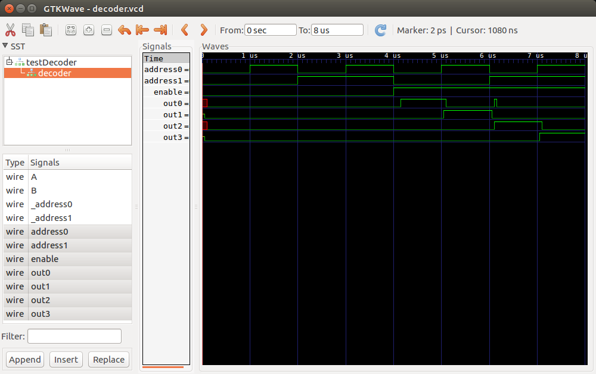
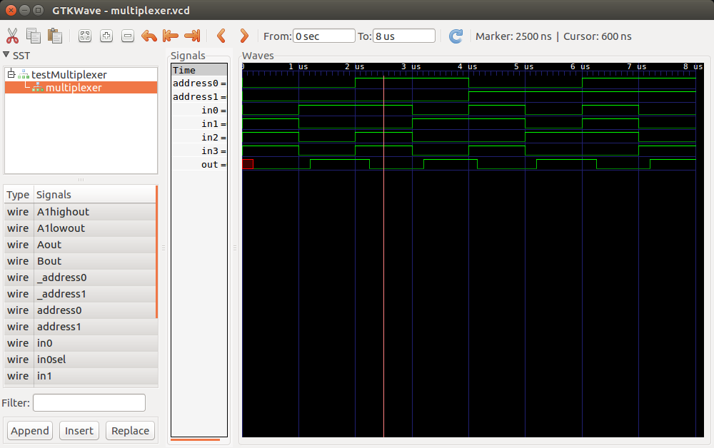
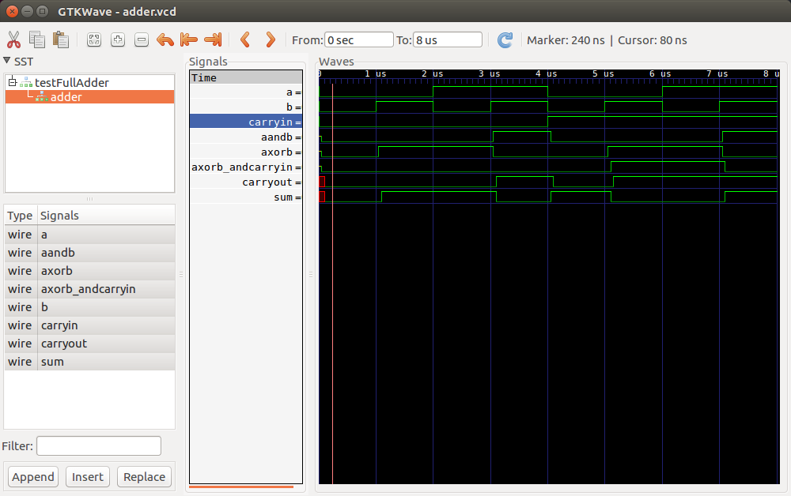

# HW2 Write Up
## Alexander Hoppe

## 2-bit Decoder w/ Enable
The decoder is two stages of a simple signal splitting unit. The basic unit is a pair of `AND` gates connected to the signal that is being "split", and with their other inputs tied to a selector signal and its inversion. Cascading two of these stages in a row allows the `Enable` signal to be "split" into four different outputs.

### Test Bench Output
```
En A0 A1| O0 O1 O2 O3 | Expected Output
0  0  0 |  0  0  0  0 | All false
0  1  0 |  0  0  0  0 | All false
0  0  1 |  0  0  0  0 | All false
0  1  1 |  0  0  0  0 | All false
1  0  0 |  1  0  0  0 | O0 Only
1  1  0 |  0  1  0  0 | O1 Only
1  0  1 |  0  0  1  0 | O2 Only
1  1  1 |  0  0  0  1 | O3 Only
```
### Waveforms


## 4-bit Multiplexer
The multiplexer is two stages of selectors cascaded together, similar to the decoder. The selector unit is comprised of two `AND` gates each connected to an input and a selector signal or its inverse. To avoid the `AND` gates fighting an output, their outputs are `OR`ed together. In this way, `n` input signals can select between `2^n` outputs.

### Test Bench Output
```
A1 A0 | I0 I1 I2 I3  |  O | Expected Output
0  0  |  0  1  1  1  |  0 | Input 0
0  0  |  1  0  0  0  |  1 | Input 0
0  1  |  1  0  1  1  |  0 | Input 1
0  1  |  0  1  0  0  |  1 | Input 1
1  0  |  1  1  0  1  |  0 | Input 2
1  0  |  0  0  1  0  |  1 | Input 2
1  1  |  1  1  1  0  |  0 | Input 3
1  1  |  0  0  0  1  |  1 | Input 3
```
Is there a good way to define X as an input for truth-table verification?

### Waveforms


## 1-bit Full Adder
The 1-bit adder required two different stages. I first developed the stage to create the sum, `S`, which is `(A XOR B) XOR Cin`. I realized that `S` was `A XOR B` when `Cin` was 0, and it was the inverse of that when `Cin` was 1. By making a truth table, I realized that `XOR` can be used like an inverter with an enable function:

```
Inverter    
w/ Enable   XOR
I  E | O    A  B | A XOR B
0  0 | 0    0  0 | 0
1  0 | 1    1  0 | 1
0  1 | 1    0  1 | 1
1  1 | 0    1  1 | 0
```

The next stage was to create `Cout`, which I figured out to be `AB + (A XOR B)Cin` by looking at the full truth table.

### Test Bench Output
```
A  B  Cin | S Cout | Expected Output
0  0   0  | 0   0  | 0  0
0  1   0  | 1   0  | 1  0
1  0   0  | 1   0  | 1  0
1  1   0  | 0   1  | 0  1
0  0   1  | 1   0  | 1  0
0  1   1  | 0   1  | 0  1
1  0   1  | 0   1  | 0  1
1  1   1  | 1   1  | 1  1
```

### Waveforms

