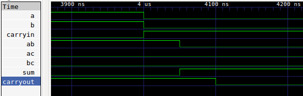

# Homework 2 Writeup
Rocco DiVerdi

### Adder

The adder has three inputs (a0, a1, and cin) and two outputs (sum and cout). The output for sum is the ones digit of the sum of a, b, and cin, and the output for s is the "tens" digit of the sum. The test shown below demonstrates my working verilog code through a truth table.

The gate propogation delays are shown here:

The adder reaches its final state after a maximum of two gate delays (100 ns).

### Multiplexer

The functionality of the four input multiplexer is shown in the truth table below:
 

The gate propogation delays are shown here:

The multiplexer reaches its final state after a maximum of two gate delays (150 ns).

### Decoder

The four output enabled decoder test is shown below

The gate propogation delays are shown here:

The decoder reaches its final state after two gate delays (100 ns).
